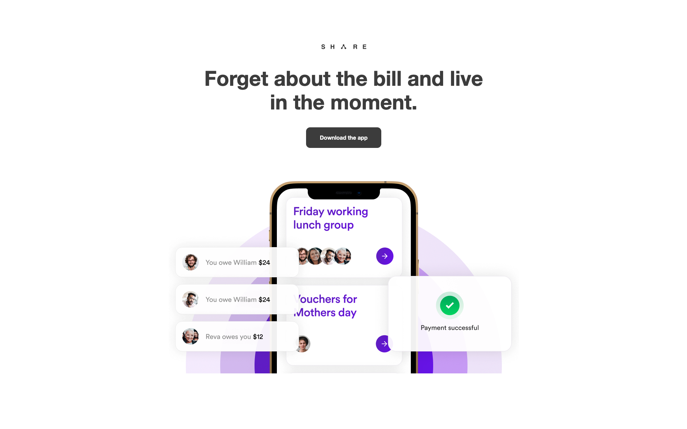

# Share

Single-page SaaS site built with CloudCannon's [Bookshop starter components](https://github.com/CloudCannon/starter-components).
Browse through a [live demo](https://hopeful-shoe.cloudvent.net/).

Share was made by [CloudCannon](http://cloudcannon.com/), the Git CMS for everyone.
This site works as-is, but is designed to be edited within the CloudCannon Visual Editor.

Start with `npm start`. To use a local copy of the starter components, clone https://github.com/cloudcannon/starter-components alongside this repo and run `npm run local-start` here.

## Features
* Pre-built single page brochure site
* Multiple configurable sections to creatively showcase your product
* Pre-styled configurable components
* Optimised for live visual editing in [CloudCannon](https://cloudcannon.com/)

## Develop
Share was built with [Hugo](https://gohugo.io/) version `v0.101.0`, but should support newer versions as well.

### Prerequisites
* [Hugo](https://gohugo.io/getting-started/installing/). Install using: `brew install hugo`
* [Go](https://go.dev/learn/). Install using: `brew install go`

### Quickstart
1. In the terminal at the root of the repo, run: `npm i`
2. Start site and bookshop: `npm run dev`   OR site alone: `npm run start`
* By default bookshop live browser will be at : [http://localhost:30775/](http://localhost:30775/)
* By default the site will be at : [http://localhost:1313/](http://localhost:1313/)

Either command will build your site and serve it locally. With the server running, changes you make to your site will appear live in the browser.

### Updating the Starter Components
This site was built using the CloudCannon [Bookshop starter components](https://github.com/CloudCannon/starter-components).
This template will generally be updated whenever the starter components are updated.

If this is not the case (for example, you are using a fork), you can run `npm run update-components`. This will pull the latest version of the starter components and merge them into this repository. This should not overrwrite any changes you have made to the starter components.

### Custom Components
You can add your own Bookshop components to this site.

## Editing
Share is already optimised for adding, updating and removing sections and components in [CloudCannon](https://app.cloudcannon.com/).

You can use the CloudCannon Visual Editor to edit this site. CloudCannon will also serve a free live preview that can be accessed via the internet.